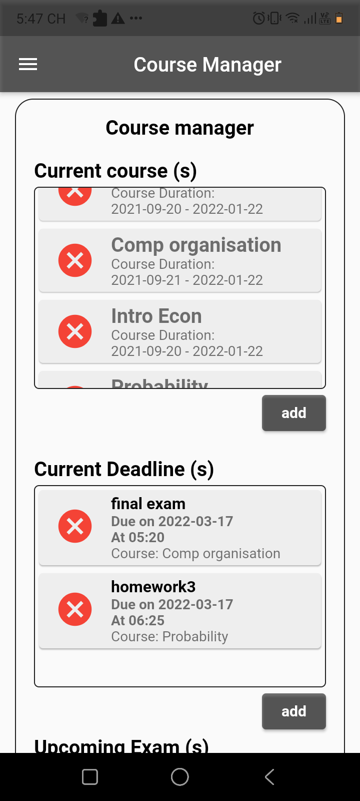
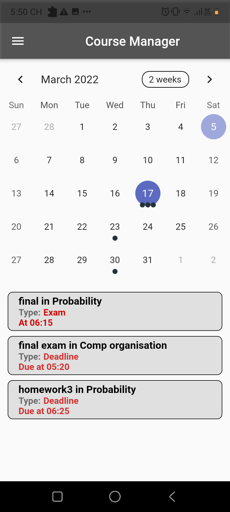
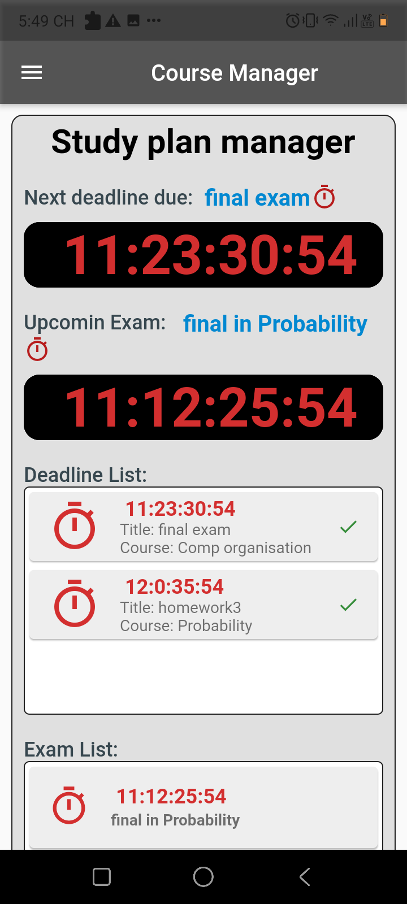

# Deadline_tracker
Deadline tracker  is a time management and calendar app that aims to help manage a courses work, and exams, along with the course 
schedule. 
Functional Specification.
+ Weekview and Month view calendar to help keep track of upcoming events and deadlines
+ Easy to use UI/UX, customized for easy course set-up 
+ Study plan countdown helps you keep track of all deadlines, exams and let you make a study plan

Deadline-tracker was built with flutter and Firebase
 
  

